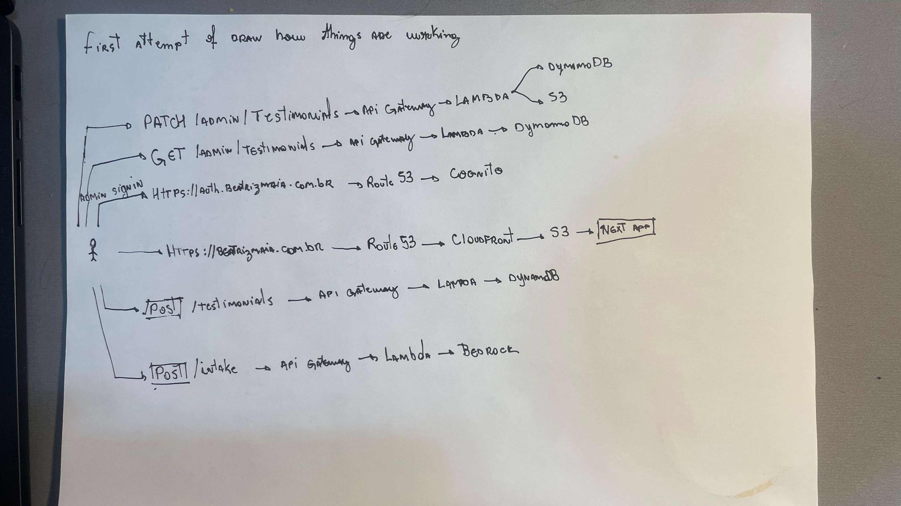

# No Country for Old Firebase Projects — My Unexpected Journey into AWS

Recently I created an simple and static page for a local lawer here called Beatriz Maia, aka my wife. Hosted in cloudflare, all good, working fine. Until I decided to move it to the AWS and start this Odissey. How and why this whole time, in 10 years, I procastinate so long to dive into this thing. idk.

Always using Firebase for freelance, MPVs, personal projects and even for a production chat feature from a company that I worked for in 2019. IMHO Pros and Cons of Firebase: too easy to use, this fits for PRO and CON. Never felt that I was dealing with the infrastructure, db, network, security, never felt that I was dealing with something that companies used to deal.

---

- **Goal:** Learn AWS
- **How:** Moving a static site there and then add some features.
- **Why:** I want/need.

---

I'll start writing down just using my memory.

I used ChatGPT to guide me through the process, where do I needed to go, what to do, why to do this and that, but never "create this to me, here is my credentials", nothing with terraform, aws cli, cdk, all manually like the stone age. I started and then tons of concepts, which some of them I already knew but others was new to me: Cloudfront, Route53, ACL, S3, WAF, IAM, Invalidation.

After I created everything, and all is running, 1 week later Im here writing a blog because I don't remember things that I did. Of course I know, but the details and the clear architecture is not in my head. probably I spend 1/2 days doing this, later I added a testimonials sections to visitors add some comments about last or current experiences about Beatriz work. Then, more concepts: API Gateway, DynamoDB, Lambda, more IAM Roles, Policies.

Then visitors add comments but I cannot let all comments show in the page for obvious reasons. I needed a moderation, which means admin page, which means restrict area, which means more concepts: Cognito, User Pools, more IAM roles and permissions.

Last but not least, I decided to add the IA to pre-triage the visitor, maybe your case don't fit inside the Beatriz office area, maybe does. Yes, more concepts: Bedrock, Budget alerts, Guardrails.

This is my description just writing down what I remember, now I'll ask for all services and terminologies used last week for AI:

- Route 53
- ACM
- CloudFront
- S3
- WAF
- API Gateway
- Lambda
- DynamoDB
- Cognito
- Bedrock
- AWS Budgets
- IAM
- CloudWatch

Ok, good memory, lets dive into each one and then connect everything.

---

## Route 53

**My definition:**

I don't know yet :)

**AWS official definition:**

> “Amazon Route 53 is a highly available and scalable Domain Name System (DNS) web service.” — [AWS documentation](https://docs.aws.amazon.com/Route53/latest/DeveloperGuide/Welcome.html)

## ACM

**My definition:**

Generate a SSL certification which will be used in the Cloudfront. Https on your site.

**AWS official definition:**

> “AWS Certificate Manager (ACM) handles the complexity of creating, storing, and renewing public and private SSL/TLS X.509 certificates and keys.” — [AWS documentation](https://docs.aws.amazon.com/acm/latest/userguide/acm-overview.html)

## CloudFront

**My definition:**

Will serve files that you have in S3, like your index.html.

**AWS official definition:**

> “Amazon CloudFront is a web service that speeds up distribution of your static and dynamic web content.” — [AWS documentation](https://docs.aws.amazon.com/AmazonCloudFront/latest/DeveloperGuide/Introduction.html)

## S3

**My definition:**

Storage, where you put your build folder, images, index, html, your page is there.

**AWS official definition:**

> “Amazon Simple Storage Service (Amazon S3) is an object storage service that offers industry-leading scalability, data availability, security, and performance.” — [AWS documentation](https://docs.aws.amazon.com/AmazonS3/latest/userguide/Welcome.html)

## WAF

**My definition:**

Web Application Firewal, some protection layer which is in front of the cloudfront. Do some XSS and bunch of other protections in your app.

**AWS official definition:**

> “AWS WAF is a web application firewall that lets you monitor and manage web requests that are forwarded to protected AWS resources.” — [AWS documentation](https://docs.aws.amazon.com/waf/)

## API Gateway

**My definition:**

This will call your correct Lambda. When you deploy an Express server, we have the server running with the endpoints to call like GET /posts. This goes to the server, to the exact route and do whatever needs to do. Working with Lambda, serverless functions, we need the API Gateway in front of it to expose this route, to have the endpoint to call. Lambda has the logic, what will be executed, but you don't call the lambda directly, you call the API Gateway, and the request is forward to Lambda.

**AWS official definition:**

> “Amazon API Gateway is an AWS service for creating, publishing, maintaining, monitoring, and securing REST, HTTP, and WebSocket APIs at any scale.” — [AWS documentation](https://docs.aws.amazon.com/apigateway/latest/developerguide/welcome.html)

## Lambda

**My definition:**

Serverless functions which doesn't export the api routes, at least in what I tested and used until now. You add here the business logic, what will be executed. API Gateway will handle the requests and call the correct Lambda based on the request.

**AWS official definition:**

> “AWS Lambda is a serverless compute service that lets you run code without provisioning or managing servers.” — [AWS documentation](https://docs.aws.amazon.com/lambda/latest/dg/welcome.html)

## DynamoDB

**My definition:**

NoSQL Key-Value database.

**AWS official definition:**

> “Amazon DynamoDB is a serverless, fully managed, distributed NoSQL database with single-digit millisecond performance at any scale.” — [AWS documentation](https://docs.aws.amazon.com/amazondynamodb/latest/developerguide/Introduction.html)

## Cognito

**My definition:**

Auth provider service. Here you can configure the authentication in your app, the sign in page, customize it, add some custom domain, manage the users, create a user pool, add application that will use the auth flow. User pool I think it's something created to isolate users, if you think about multi-tenant application, each app must have a user pool, I think.

**AWS official definition:**

> “Amazon Cognito is an identity platform for web and mobile apps.” — [AWS documentation](https://docs.aws.amazon.com/cognito/latest/developerguide/what-is-amazon-cognito.html)

## Bedrock

**My definition:**

IA service. You can create the instance, select the model, create the constraints, fine tune it, rules. You can create a different guardrails and attach to the bedrock instance that you created. You will have a endpoint which will be called by Lambda to process the data.

**AWS official definition:**

> “Amazon Bedrock is a fully managed service that provides secure, enterprise-grade access to high-performing foundation models from leading AI companies.” — [AWS documentation](https://docs.aws.amazon.com/bedrock/latest/userguide/what-is-bedrock.html)

## AWS Budgets

**My definition:**

Important to create alerts of your usage and don't be surprised at the end of the month. You can create a global budget alerts for your whole account or based on one specific project or service.

**AWS official definition:**

> “You can use AWS Budgets to track and take action on your AWS costs and usage.” — [AWS documentation](https://docs.aws.amazon.com/cost-management/latest/userguide/budgets-managing-costs.html)

## IAM

**My definition:**

So important in all services. Allows AWS services comunicate between them. When you have a Lambda doing some change in DynamoDB and later updatind some file in S3. This lambda will need a role to do this. This role must contains the policies. Which is basically something like:

- the service which use the role with this police, will be able to read, post and patch the DynamoDB
- the service which use the role with this police, will be able to update a file in S3

Of course, in AWS Role language.

**AWS official definition:**

> “AWS Identity and Access Management (IAM) is a web service that helps you securely control access to AWS resources.” — [AWS documentation](https://docs.aws.amazon.com/IAM/latest/UserGuide/introduction.html)

## CloudWatch

**My definition:**

Usefull to know what is going on. Usually you access it when something is wrong, then you came here, dig into logs, look at dates column, quickly remember when you press the button and nothing happened, open one, two, three logs, then suddently you see that service A doesn't have rights to interact with service B. Just an exemple, could it be 1mi of different errors.

**AWS official definition:**

> “Amazon CloudWatch monitors your AWS resources and the applications you run on AWS in real time.” — [AWS documentation](https://docs.aws.amazon.com/AmazonCloudWatch/latest/monitoring/WhatIsCloudWatch.html)

---

### First hand-drawn attempt at mapping how the Beatriz Maia website works

